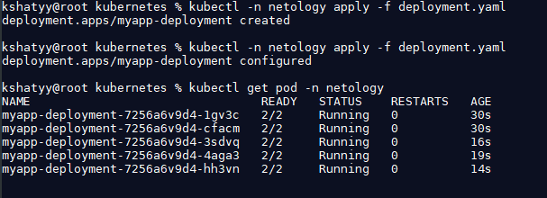
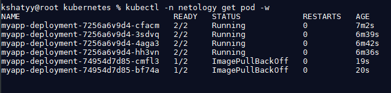
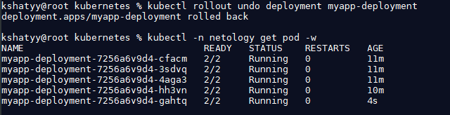

# Домашнее задание к занятию "`Обновление приложений`" - `Шатый Константин`

### Инструкция по выполнению домашнего задания

   1. Сделайте `fork` данного репозитория к себе в Github и переименуйте его по названию или номеру занятия, например, https://github.com/имя-вашего-репозитория/git-hw или  https://github.com/имя-вашего-репозитория/7-1-ansible-hw).
   2. Выполните клонирование данного репозитория к себе на ПК с помощью команды `git clone`.
   3. Выполните домашнее задание и заполните у себя локально этот файл README.md:
      - впишите вверху название занятия и вашу фамилию и имя
      - в каждом задании добавьте решение в требуемом виде (текст/код/скриншоты/ссылка)
      - для корректного добавления скриншотов воспользуйтесь [инструкцией "Как вставить скриншот в шаблон с решением](https://github.com/netology-code/sys-pattern-homework/blob/main/screen-instruction.md)
      - при оформлении используйте возможности языка разметки md (коротко об этом можно посмотреть в [инструкции  по MarkDown](https://github.com/netology-code/sys-pattern-homework/blob/main/md-instruction.md))
   4. После завершения работы над домашним заданием сделайте коммит (`git commit -m "comment"`) и отправьте его на Github (`git push origin`);
   5. Для проверки домашнего задания преподавателем в личном кабинете прикрепите и отправьте ссылку на решение в виде md-файла в вашем Github.
   6. Любые вопросы по выполнению заданий спрашивайте в чате учебной группы и/или в разделе “Вопросы по заданию” в личном кабинете.
   
Желаем успехов в выполнении домашнего задания!
   
### Дополнительные материалы, которые могут быть полезны для выполнения задания

# Задание 1. 

Задание 1. Выбрать стратегию обновления приложения и описать ваш выбор
Имеется приложение, состоящее из нескольких реплик, которое требуется обновить.
Ресурсы, выделенные для приложения, ограничены, и нет возможности их увеличить.
Запас по ресурсам в менее загруженный момент времени составляет 20%.
Обновление мажорное, новые версии приложения не умеют работать со старыми.
Вам нужно объяснить свой выбор стратегии обновления приложения.

# Решение: 

Для такой ситуации наиболее подходящей стратегией обновления может быть стратегия Rolling Update, она позволяет постепенно обновлять реплики приложения, 
минимизируя простой работы и сохраняя доступность. Использование запаса по ресурсам в менее загруженные периоды можно связать с управлением параметрами maxSurge и maxUnavailable во время обновления приложения.

# Задание 2. 

[deployment.yaml](https://github.com/netology-code/sys-pattern-homework/blob/main/screen-instruction.md)

